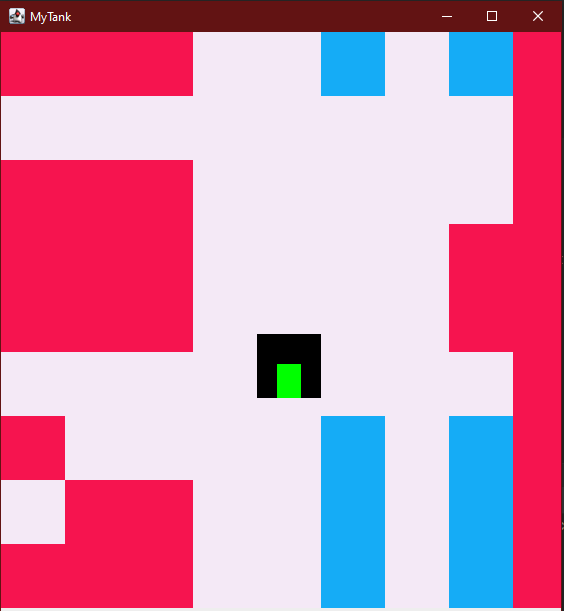

# myTank

Инди игра - аналог танчиков 1970х годов, написанная на бибилиотеке SWING

# TODO

1. Настроить проект для получения исполняемого JAR файла
2. Избавиться от кислотной играфики
3. Добавить управление танком
4. Добавить выстрелы-пули

# DevBlog

### Day 1 (10.11.2021)

Реализован чат и прототип игры 

[ЧАТ](https://www.youtube.com/watch?v=pcIoZA2c-5k&t=2056s) - Алексей Степченко

За исходный проект взят [туторил с Ютуба](https://www.youtube.com/watch?v=GXL2MGKlRkw&t=3201s)